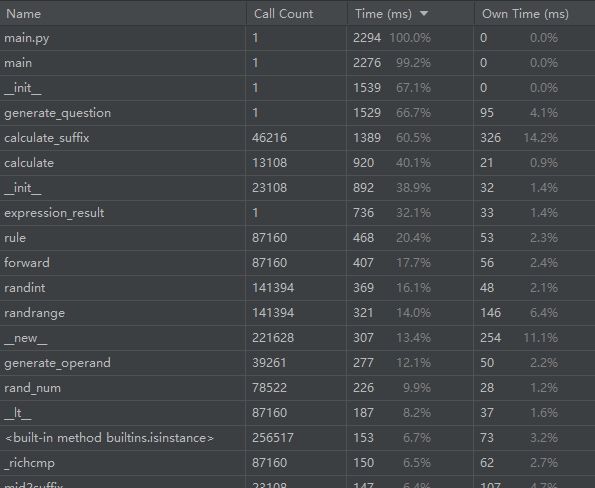
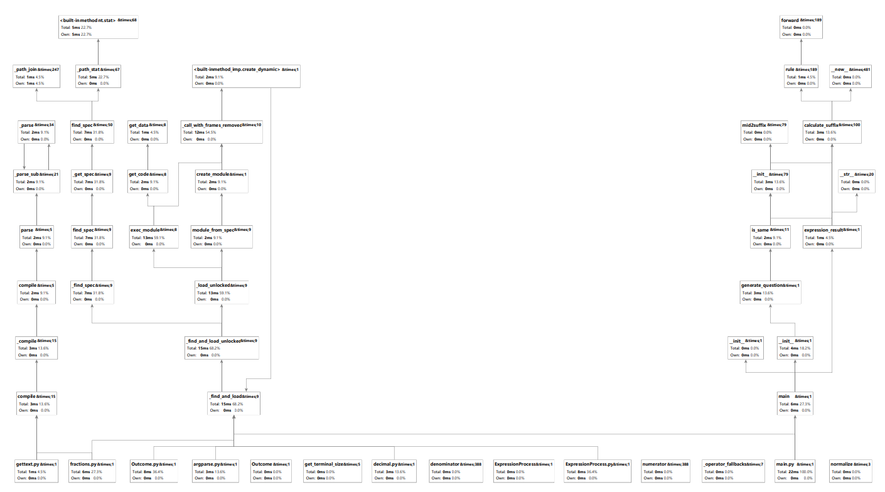

| 这个作业属于哪个课程 | [软件工程](https://edu.cnblogs.com/campus/gdgy/CSGrade21-12) |
| :-----------------: |:---------------: |
| 这个作业要求在哪里| [结对项目](https://edu.cnblogs.com/campus/gdgy/CSGrade21-12/homework/13016) |
| 这个作业的目标 |熟悉多人协作|

成员👨‍💻：**戴子豪**3121004649、**朱俊荣**3121004677

GitHub项目地址🔗：https://github.com/HaoDavis/FourOperations
# 效能分析
## 改进思路
1. is_same 改用 hash 对照的方法，不需要遍历表达式列表，而是将表达式列表里的每一个表达式都转换成 hash 值，再用新的表达式与之对比，这样不需要重复遍历表达式列表，也不用重复计算某条表达式的 hash ，效率大幅提高。
2. 在 check_result 函数中，用 zip 函数将表达式列表和答案列表打包成一个元组， 再用 map 函数对每一个元组进行判断，提高了效率。
## 性能分析图


# 设计实现过程
1. Tree 类：由于要判断两个等式本质上是否是一样的，要先将中缀表达式转换为二叉树，用的是 gnerate_tree 函数，然后判断两棵树本质上是否相同，用的是 is_same_tree 函数。
2. ExpressionProcess 类：用于处理表达式，包括将中缀表达式转换为后缀表达式，用的是 mid2suffix 函数。以及计算后缀表达式，用的是 calculate_suffix 函数。
3. Generate 类：就像类名一样，这个类里包含很多生成所需内容的函数，包括生成运算符、生成运算数 generate_operand 、生成并插入括号 generate_parentheses 以及处理分数的格式等。还有 generate_question 函数它通过调用其他函数，生成题目和答案。 最重要的是 is_same 函数，它用 hash 来判断新生成的表达式是否与之前的表达式相同。
具体实现如下：
```python
    def is_same(self, express_set, expression):
        # 使用哈希表来存储已生成的表达式的哈希值
        hash_set = set()

        # 计算新生成表达式的哈希值
        suffixExpression = ExpressionProcess(expression)
        target_exp_suffix = suffixExpression.re
        target_exp_hash = hash("".join(target_exp_suffix))

        # 如果哈希值已经存在于哈希集合中，表明表达式重复
        if target_exp_hash in hash_set:
            return True

        # 否则，将哈希值添加到哈希集合中，并继续检查集合中的其他表达式
        hash_set.add(target_exp_hash)

        for item in express_set:
            suffixExpression2 = ExpressionProcess(item)
            source_exp_suffix = suffixExpression2.re
            source_exp_hash = hash("".join(source_exp_suffix))

            if source_exp_hash in hash_set:
                return True

        return False
```
4. Outcome 类：用写入答案以及实现答案检查。 expression_result 将获取到的答案写入 Answers.txt 文件中，做了改进保证写入的答案是带分数也不是真分数。细节如下：
```python
    def expression_result(self, expressions):
        with open('Answer.txt', 'w', encoding='utf-8') as file:
            for i, exp in enumerate(expressions):
                suffix_expression = ExpressionProcess(exp)
                exp_value = suffix_expression.calculate_suffix()
                flag = float(exp_value)
                exp_value = str(exp_value)
                if '/' in exp_value and flag > 1:
                    a,b = exp_value.split('/')
                    a = int(a)
                    b = int(b)
                    # 转化成真分数
                    c = a//b
                    d = a%b
                    e = str(c)+'’'+str(d)+'/'+str(b)
                    exp_value = e
                result = f"Answer{i + 1}: {exp_value}\n"
                file.write(result)
```
使用上下文管理器。这确保了文件在不再需要时会被正确关闭。这有助于避免资源泄漏和文件锁定问题。另外，在 check_result 方法检查答案时，用zip函数将表达式列表和答案列表打包成一个元组，并行迭代对比给定的文本答案与正确答案，简化代码并提高可读性。静态方法可以提高代码的可维护性和可重用性，
```python
   @staticmethod
    def check_result(exercisefile, answerfile):
        correct_list, wrong_list = [], []
        exercise_answer = []

        try:
            with open(exercisefile, 'r', encoding='utf-8') as exercise_file, \
                    open(answerfile, 'r', encoding='utf-8') as answer_file:

                for (exp_line, ans_line) in zip(exercise_file, answer_file):
                    exp_match = re.match(r'Question\d+: (.*) =\n', exp_line)
                    ans_match = re.match(r'Answer\d+: (.*)\n', ans_line)

                    if exp_match and ans_match:
                        exp = exp_match.group(1)
                        ans = ans_match.group(1)

                        p = ExpressionProcess(exp)
                        exp_value = p.calculate_suffix()
                        flag = float(exp_value)
                        exp_value = str(p.calculate_suffix())
                        if '/' in exp_value and flag > 1:
                            a, b = exp_value.split('/')
                            a = int(a)
                            b = int(b)
                            # 转化成真分数
                            c = a // b
                            d = a % b
                            e = str(c) + '’' + str(d) + '/' + str(b)
                            exp_value = e
                        exercise_answer.append(exp_value)

                        if ans == exp_value:
                            correct_list.append(len(correct_list) + 1)
                        else:
                            wrong_list.append(len(wrong_list) + 1)

            with open('Grade.txt', 'w+', encoding='utf-8') as grade_file:
                grade_file.write(f'Correct: {len(correct_list)} {correct_list}\n')
                grade_file.write(f'Wrong: {len(wrong_list)} {wrong_list}')

        except IOError:
            print('请检查文件路径是否正确')
```
# 代码说明
1. Gnerator 类中的 fraction_to_str 函数，用于将分数转换为字符串，方便写入文件。
```python
    def fraction_to_str(self, operArray):
        operNum1, operNum2 = operArray

        if operNum2 == 1:
            return operNum1

        if operNum1 > operNum2:
            temp = operNum1 // operNum2
            operNum1 -= temp * operNum2
            return f"{temp}'{operNum1}/{operNum2}"

        return f"{operNum1}/{operNum2}"
```
2. ExpressionProcess 类中的 mid2suffix 函数，用于将中缀表达式转换为后缀表达式。算法如下：
    1. 遇到操作数时直接加入集合
    2. 遇到操作符，与栈顶操作符比较优先级如果栈为空，或者栈顶元素为(，直接加入栈。如果优先级比栈顶操作数高，直接加入栈。如果优先级比栈顶操作符低或者相等，则弹出栈顶元素入集合，再次进行对比
    3. 遇到括号时:如果为左括号，直接加入栈。如果为右括号，依次弹出栈顶元素入集合，并且再次对比，直到遇到左括号，弹出栈顶元素不入集合。
    4. 最后将栈顶元素依次弹出入集合。
```python
    def mid2suffix(self):
        """
        中缀表达式转为后缀表达式
        :param: exp: 表达式字符串
        :return: result列表
        """
        if not self.exp:
            return []
        ops_rule = {
            '+': 1,
            '-': 1,
            '×': 2,
            '÷': 2,
        }
        suffix_stack = []  # 后缀表达式结果
        ops_stack = []  # 操作符栈
        infix = self.exp.split(' ')  # 将表达式分割得到单词
        # print(infix)
        for item in infix:
            if item in ['+', '-', '×', '÷']:
                while ops_stack and ops_stack[-1] != '(' and ops_rule[item] <= ops_rule.get(ops_stack[-1], 0):
                    suffix_stack.append(ops_stack.pop())
                ops_stack.append(item)
            elif item == '(':
                ops_stack.append(item)
            elif item == ')':
                while ops_stack and ops_stack[-1] != '(':
                    suffix_stack.append(ops_stack.pop())
                ops_stack.pop()  # 弹出 '('
            else:
                suffix_stack.append(item)

        while len(ops_stack) > 0:
            suffix_stack.append(ops_stack.pop())

        self.re = suffix_stack
        return suffix_stack
```
3. ExpressionProcess 类中的 calculate_suffix 函数，用于计算后缀表达式的值。算法如下：
    1. 字符为运算数: 直接入栈(先分析出完整的运算数并将其转换为对应的数据类型)
    2. 字符为操作符: 连续出栈两次，使用出栈的两个数据进行相应计算，并将计算结果入栈 e.g:第一个出栈的运算数为a，第二个出栈的运算数为b，此时的操作符为-，则计算 b-a(a和b顺序不能反)，并将结果入栈。
    3. 重复以上步骤直至遍历完成后缀表达式，最后栈中的数据就是中缀表达式的计算结果。
```python
    def calculate_suffix(self):
        """
        后缀表达式求值
        :return 运算结果
        """
        stack_value = []
        for item in self.re:
            # print("item")
            # print(item)
            if item in ['+', '-', '×', '÷']:
                n2 = stack_value.pop()
                n1 = stack_value.pop()
                result = self.rule(n1, n2, item)
                if result < 0 or result == False:
                    return False
                stack_value.append(result)
            else:
                if item.find('/') > 0:
                    attach = 0
                    right = ""
                    if item.find("'") > 0:
                        parts = item.split("'")
                        attach = int(parts[0])
                        right = parts[1]
                    else:
                        right = item
                    parts = right.split('/')
                    result = Fraction(attach * int(parts[1]) + int(parts[0]), int(parts[1]))
                    stack_value.append(result)
                else:
                    stack_value.append(Fraction(int(item), 1))

        return stack_value[0]
```
# 测试运行
利用unittest单元测试框架,实现单元测试自动化，以下仅列举部分用例。
1. 正确情况下的中缀表达式转后缀表达式：
```python
    def test_mid2suffix(self):
        # 测试中缀表达式转后缀表达式
        exp = "1 + 2 + 3"
        exp_process = ExpressionProcess(exp)
        self.assertEqual(exp_process.re, ['1', '2', '+', '3', '+'])
```
2. 缺少操作数的中缀表达式转后缀表达式：
```python
    def test_mid2suffix2(self):
        # 测试中缀表达式转后缀表达式
        exp = "1 + 2 +"
        with self.assertRaises(IndexError):
            exp_process = ExpressionProcess(exp)
```
3. 正确情况下的后缀表达式求值：
```python
    def test_calculate_suffix(self):
        # 测试后缀表达式求值
        exp = "1 2 + 3 +"
        exp_process = ExpressionProcess(exp)
        self.assertEqual(exp_process.value, 6)
```
4. 缺少操作数的后缀表达式求值：
```python
    def test_calculate_suffix2(self):
        # 测试后缀表达式求值
        exp = "1 + 2 "
        with self.assertRaises(ValueError):
            exp_process = ExpressionProcess(exp)
```
5.  测试生成题目：
```python
    def test_generate_question(self):
        # 测试生成题目
        gen = Generator(10, 10)
        question = gen.generate_question()
        self.assertEqual(len(question), 10)
```
6. 测试生成括号：
```python
    def test_generate_parentheses(self):
        # 测试生成括号
        gen = Generator(10, 10)
        question = gen.generate_parentheses("1 + 2 + 3", 2)
        self.assertEqual("(" in question, True)
```
7. 测试中缀表达式转后缀表达式：
```python
    def test_mid2suffix3(self):
        # 测试中缀表达式转后缀表达式
        exp = "1 + 5 × ( 3 + 2 ) - 4 × 5"
        exp_process = ExpressionProcess(exp)
        self.assertEqual(exp_process.re, ['1', '5', '3', '2', '+', '×', '+', '4', '5', '×', '-'])
```
8. 测试小数转分数：
```python
    def test_to_fraction(self):
        # 测试小数转分数
        self.assertEqual(Generator.to_fraction(self, 1, 2), [1, 2])
```
9. 测试获取公因子：
```python
    def test_get_common_factors(self):
        # 测试获取公因子
        self.assertEqual(Generator.get_common_factors(self, 6), [2, 3, 6])
```
10. 测试数字转符号：
```python
    def test_num2symbol(self):
        # 测试数字转符号
        self.assertEqual(Generator.num2symbol(self, 1), "+")

```
11. 测试判断重复：
```python
    def test_is_same(self):
        # 测试判断重复
        self.assertEqual(Generator.is_same(self, [], "1 + 2"), False)
```
# 项目小结
- **朱俊荣**：is_same 函数一开始用暴力法遍历表达式列表，来寻找是否有与新生成出表达式相同的表达式，但效率很低，因为 is_same 底层调用了便利二叉树的函数。后来将表达式列表里的每一个表达式都转换为一个 hash ，然后对于已经产生 hash 的表达式，在后续的判断中就不需要重新遍历他们，这样就将程序运行时间减半。另外答案检查函数中的 zip 手法也提高了效率。另外，这个项目非常综合，考察到了很多方面的内容，有一些规则的判定并没有现成的算法可以参考，需要自己试错。我的伙伴有很好的 Python 语法功底，也很熟练地使用 git 和一些测试工具，让我们的开发效率大大提高。深刻感受到，很多 bug 若是两个人在一起观察讨论就很容易解决，达到一加一远大于二的效果。
- **戴子豪**：结对项目和个人项目很不一样，与人合作增加了不少的沟通协调成本，前期沟通、项目的规划占用了不少的时间，但好处是有人帮忙，可以各取所长。从中吸取的经验是，尽量少规划早动手，边动手边讨论边解决，但是也不能毫无规划，前期应明确各人任务，避免杂乱无章。
# 附录
## PSP表格
|**PSP2.1**|**Personal Software Process Stages**| **预估耗时（分钟）** | **实际耗时（分钟）** |
| :------------: | :------------: |:------------:|:------------:|
|Planning|计划|      60      |      60      |
|Estimate|估计这个任务需要多少时间|      30      |      20      |
|Development|开发|     400      |     400      |
|Analysis|需求分析 (包括学习新技术)|      60      |      60      |
|Design Spec|生成设计文档|     120      |      60      |
|Design Review|设计复审|      60      |      30      |
|Coding Standard|代码规范 (为目前的开发制定合适的规范)|      30      |      30      |
|Design| 具体设计|      60      |      60      |
|Coding|具体编码|     300      |     300      |
|Code Review|代码复审|      30      |      20      |
|Test|测试（自我测试，修改代码，提交修改）|      60      |      60      |
|Reporting|报告|      60      |      60      |
| Test Repor|测试报告|      30      |      20      |
| Size Measurement|计算工作量|      20      |      10      |
|Postmortem & Process Improvement Plan|事后总结, 并提出过程改进计划|      60      |      20      |
|Total|合计|     1380     |     1210     |

## 参考
- [re --- 正则表达式操作](https://docs.python.org/zh-cn/3/library/re.html)
- [unittest --- 单元测试框架](https://docs.python.org/zh-cn/3/library/unittest.html)
